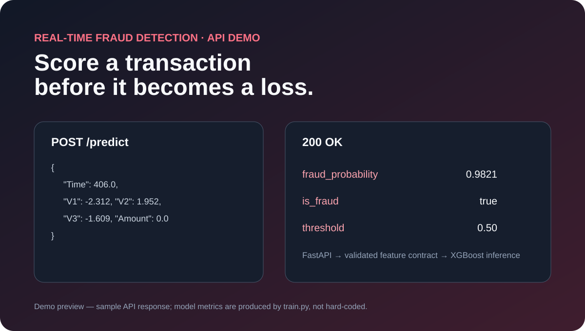
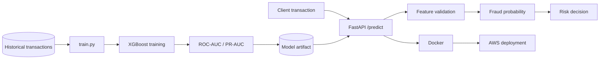

# Real-Time Fraud Detection Microservice

> Production-style **FastAPI + XGBoost** service for low-latency credit-card fraud scoring, with offline training, model artifact versioning, Docker, tests, GitHub Actions, and an AWS deployment pattern.



## What this project demonstrates

- Separation of offline model training from online inference
- Imbalance-aware fraud classification using XGBoost
- ROC-AUC and PR-AUC evaluation
- Persisted model + feature contract using `joblib`
- Typed FastAPI REST endpoints for health, model metadata, and scoring
- Configurable decision threshold
- Dockerized inference service
- Automated tests and GitHub Actions CI
- AWS ECS/Fargate / Lambda deployment design

## Architecture



Detailed architecture: [docs/ARCHITECTURE.md](docs/ARCHITECTURE.md)

## Repository structure

```text
Real-Time-Fraud-Detection-Microservice/
├── app/
│   ├── main.py                 # FastAPI routes
│   └── model.py                # artifact loading, validation, prediction
├── artifacts/
│   └── .gitkeep                # trained model written here locally
├── data/
│   └── .gitkeep                # raw creditcard.csv lives here locally
├── tests/
│   └── test_api.py
├── deploy/
│   └── aws.md                  # AWS production deployment pattern
├── docs/
│   ├── ARCHITECTURE.md
│   └── demo.svg
├── .github/workflows/
│   └── ci.yml                  # automated test workflow
├── train.py                    # offline training/evaluation pipeline
├── Dockerfile
├── requirements.txt
└── README.md
```

## Dataset

The training pipeline expects the ULB/Kaggle credit-card fraud dataset as `data/creditcard.csv` with the standard feature schema:

`Time, V1 ... V28, Amount, Class`

`Class = 1` denotes a fraudulent transaction. The original dataset contains approximately **284,807 transactions**; the CSV is intentionally not committed to source control.

## Train the model

```bash
python -m venv .venv
source .venv/bin/activate  # Windows: .venv\Scripts\activate
pip install -r requirements.txt
mkdir -p data artifacts
# place creditcard.csv inside data/
python train.py --data data/creditcard.csv --output artifacts/fraud_model.joblib
```

The training pipeline performs a stratified split, applies imbalance-aware training, evaluates probability quality, and persists the trained model together with the feature order and decision threshold.

### Metric integrity

The resume-level **~0.97 ROC-AUC** should be presented as a verified result only after reproducing it on the exact dataset/version and experiment configuration that produced it. The repository computes evaluation metrics at training time; it does **not** hard-code an AUC value.

## API

| Endpoint | Method | Purpose |
|---|---|---|
| `/health` | GET | Service and model readiness |
| `/model-info` | GET | Stored model metadata and feature contract |
| `/predict` | POST | Return fraud probability and decision |

### Example request

```json
POST /predict
{
  "features": {
    "Time": 406.0,
    "V1": -2.312,
    "V2": 1.952,
    "V3": -1.609,
    "Amount": 0.0
  }
}
```

A real request must contain every feature stored in the trained artifact's feature contract.

Example response shape:

```json
{
  "fraud_probability": 0.9821,
  "is_fraud": true,
  "threshold": 0.50
}
```

## Run the API

```bash
uvicorn app.main:app --reload
```

Swagger UI: `http://localhost:8000/docs`

## Docker

```bash
docker build -t fraud-detection-api .
docker run -p 8000:8000 -v "$(pwd)/artifacts:/app/artifacts" fraud-detection-api
```

The container expects a trained artifact at the configured artifact path. Training and serving remain intentionally separate.

## GitHub Actions

`.github/workflows/ci.yml` runs automated validation on pushes and pull requests so API changes are checked before merge. The workflow installs dependencies and executes the test suite.

## AWS deployment pattern

The Docker image can be pushed to **Amazon ECR** and deployed on **ECS/Fargate** behind an Application Load Balancer. The repository also documents a Lambda + API Gateway alternative for lighter serverless traffic. See [deploy/aws.md](deploy/aws.md).

## Engineering decisions

- **Offline/online separation:** production API startup never retrains the model.
- **Stable feature contract:** the artifact stores training-time feature order to prevent silent inference bugs.
- **Probability-first API:** downstream systems receive a score and can tune the operating threshold based on fraud-cost tradeoffs.
- **Class imbalance awareness:** model training derives weighting from the training distribution.
- **Deployment observability:** health and metadata endpoints support probes and debugging.
- **Reproducibility:** source, requirements, Docker, tests, CI, and deployment notes live in one repository.

## Next improvements

- Model registry and semantic model versions
- Precision/recall threshold tuning based on fraud cost
- Feature drift and score-distribution monitoring
- CloudWatch dashboards and alarms
- Authentication and rate limiting
- Streaming scoring through Kinesis/SQS
- Canary deployment for new model versions
